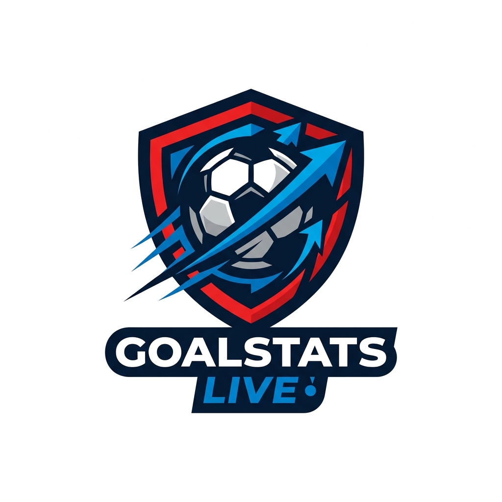

# ⚡ GOALSTATS LIVE

> **Portal Deportivo, Marcadores en Vivo y Análisis Estadístico en Tiempo Real**



## 📌 Descripción del Proyecto

**GOALSTATS LIVE** es una plataforma web moderna desarrollada con **Python (Flask)**, **Prisma ORM**, **SQLite** y un frontend interactivo diseñado bajo principios de **Glassmorphism y UI Motion**. 

La aplicación integra transmisiones en directo, noticias deportivas sincronizadas, calendarios de próximas fechas y un motor de operaciones matriciales con **NumPy** para el análisis estadístico de equipos y rendimiento de jugadores.

---

## 🔥 Características Principales

### 1. 📺 Transmisiones & Marcadores en Vivo
- **Agendamiento en Tiempo Real**: Raspado y sincronización en vivo con agendas deportivas (Rojadirecta / ESPN / Win Sports / TNT).
- **Reproductor de Canales Directo**: Reproducción integrada mediante modal interactivo.

### 2. 📊 Análisis Estadístico & Matrices (NumPy)
- **Cálculo de Rendimiento Matricial**: Operaciones matriciales con `NumPy` para evaluar porcentajes de victoria, efectividad de remates a gol y tasas de tarjetas.
- **Gráficas Interactivas**: Visualización con `Chart.js`.
- **Tabla de Posiciones Oficial**: Clasificación dinámica por ligas (Liga BetPlay 🇨🇴, LaLiga 🇪🇸, Premier League 🏴󠁧󠁢󠁥󠁮󠁧󠁢󠁳󠁣󠁴󠁿, etc.).

### 3. 👥 Gestión de Plantillas de Jugadores
- **Plantillas Oficiales**: Sincronización automática de jugadores reales por equipo.
- **Biografía & Ficha Técnica**: Modales interactivos con estadísticas individuales y métricas clave.

### 4. 🎨 Diseño UI/UX Moderno & Responsivo
- **Estética Dark Mode**: Basado en tonos azul marino (`#0b1a30`), azul eléctrico (`#2563eb`) y acentos rojos (`#ef4444`).
- **Navegación Fluida**: Interfaz adaptable a móviles, tabletas y escritorio.

---

## 🛠️ Tecnologías Utilizadas

- **Backend**: Python 3.11+, Flask 3.0+
- **Base de Datos & ORM**: Prisma ORM (Python Client), SQLite (`dev.db`)
- **Procesamiento de Datos**: NumPy, HTTPX
- **Frontend**: HTML5, Vanilla CSS3 (Glassmorphism), JavaScript (ES6+), Bootstrap Icons
- **Visualización**: Chart.js

---

## 🚀 Instalación y Configuración

### 1. Requisitos Previos
- Python 3.10 o superior instalado.

### 2. Configurar el Entorno Virtual
```bash
python -m venv .venv
.venv\Scripts\activate  # En Windows
```

### 3. Instalar Dependencias
```bash
pip install -r requirements.txt
```

### 4. Inicializar la Base de Datos con Prisma
```bash
prisma db push
```

### 5. Ejecutar la Aplicación
```bash
python app.py
```

Accede desde tu navegador en **http://localhost:5000**.

---

## 📁 Estructura del Proyecto

```
furdemy2/
├── app.py                     # Punto de entrada principal Flask
├── conf.py                    # Configuración de conexión Prisma ORM
├── schema.prisma              # Definición de modelos de base de datos
├── requirements.txt           # Dependencias de Python
├── services/                  # Blueprints y lógica de negocio
│   ├── api_football.py        # Integración de noticias y posiciones
│   ├── getStats.py            # Servicio de estadísticas principales
│   ├── ingresar_equipos.py    # Gestión de registro de equipos
│   ├── registro_estadisticas.py # Registro de estadísticas matriciales
│   ├── scraper_rojadirecta.py # Raspado de transmisiones en vivo
│   ├── stats_players.py       # Cálculo de métricas de jugadores (NumPy)
│   └── stats_service.py       # Cálculo de porcentajes y tablas de posiciones
├── static/                    # Archivos estáticos (CSS, JS, Imágenes)
│   ├── css/
│   ├── img/
│   └── js/
└── templates/                 # Plantillas Jinja2 HTML
    ├── principal.html         # Dashboard principal
    ├── estadisticas_equipos.html # Vista de tabla de posiciones
    └── plantilla_equipo.html  # Ficha de plantilla de equipo
```

---

## 📝 Licencia

Este proyecto está bajo la licencia MIT. Desarrollado para uso educativo y deportivo.
